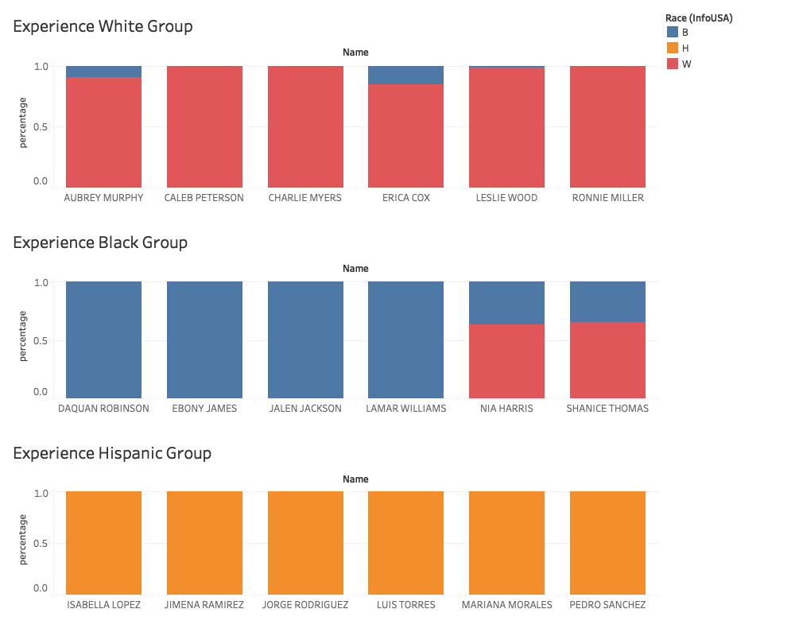
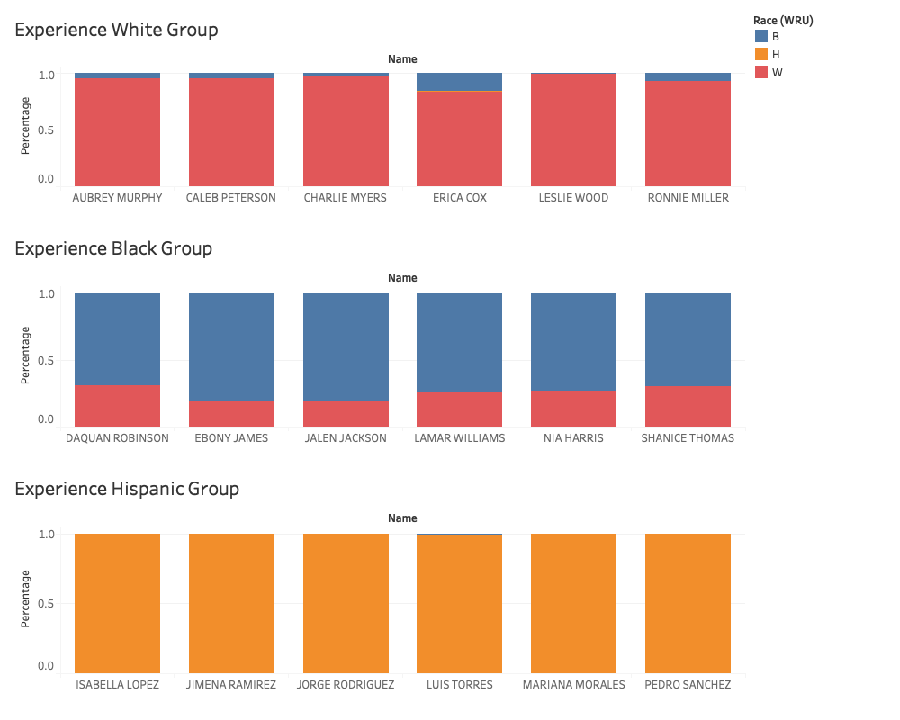

# Race Prediction Analysis
The InfoUSA data predicts the ethnicity of each of the recorded names and stores them as a separate column. The information is important for some researchers in the field of cultural differences and discrimination. Here, we analyzed the consistency of the InfoUSA prediction with that by another commonly used method, the [R WRU package](https://cran.r-project.org/web/packages/wru/wru.pdf).

According to the [specification](./Cultural Coding datacard.doc), InfoUSA divides different ethnicity groups further into subgroups. Here, we are interested in the overall groups, namely: Black, Hispanic, and White.

In this experiment, we randomly select 6 names from each of these 3 categories (by experience), and perform analysis on the consistency of prediction. The following graphs are based on a 1% sample of the entire InfoUSA dataset in year 2017.

InfoUSA:

WRU package:

For further information, check out `predict_race.R` for details.
